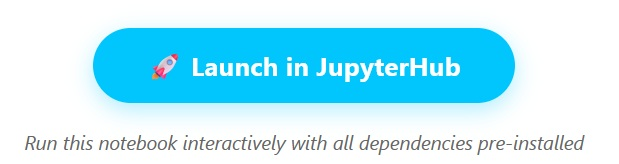

## How to run the notebooks

The notebooks can be run on the **EOPF Sentinel Zarr Samples JupyterHub**. Each notebook integrates a Launch in JupyterHub button.

---

Click **Sign in with CDSE IdP** to proceed.

You will be redirected to the CDSE login page:

---

Please log in using your **CDSE user account**.  
If you do not have one, create one now, it's free!

Once logged in, you will be able to run your notebook in JupyterLab!

---

If you encounter any problem or have suggestions, please let us know on GitHub, opening a new issue [here](https://github.com/EOPF-Sample-Service/eopf-sample-notebooks/issues).

## Notebooks Gallery

Click on the category to explore the corresponding notebooks!

### Sentinel Data
<a class="link" href="gallery-sentinel#sentinel-1" >
🛰️ sentinel-1
</a>
<a class="link" href="gallery-sentinel#sentinel-2" >
🛰️ sentinel-2
</a>
<a class="link" href="gallery-sentinel#sentinel-3" >
🛰️ sentinel-3
</a>
                
### Application Topics
<a class="link" href="gallery-topics#land-applications" >
🌱 land
</a>
<a class="link" href="gallery-topics#climate-monitoring" >
🌡️ climate-change
</a>
<a class="link" href="gallery-topics#marine-applications" >
🌊 marine
</a>
<a class="link" href="gallery-topics#emergency-and-security-applications" >
🔒 security
</a>

### Tools & Libraries
<a class="link" href="gallery-tools/#xarray" >
📊 xarray
</a>
<a class="link" href="gallery-tools/#xarray-eopf-plugin" >
🔌 xarray-eopf
</a>
<a class="link" href="gallery-tools/#xcube-eopf-plugin" >
🏷️ xcube
</a>
<a class="link" href="gallery-tools/#gdal" >
🗺️ gdal
</a>

### Basic Tutorials
<a class="link" href="gallery-tutorials/#dask" >
🧮 dask
</a>
<a class="link" href="gallery-tutorials/#basic-data-access" >
👶 basic
</a>

