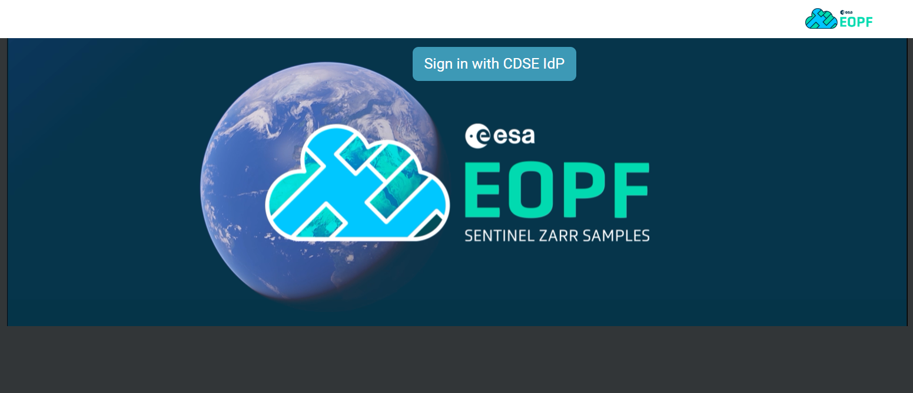
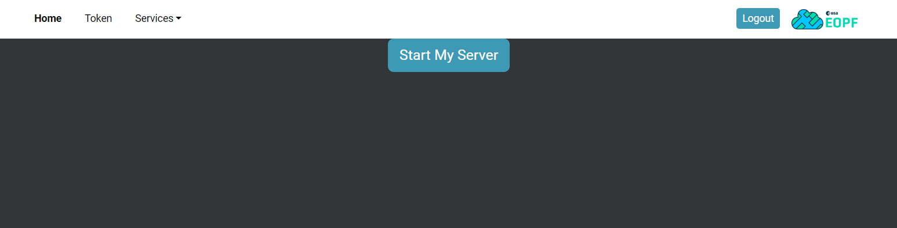
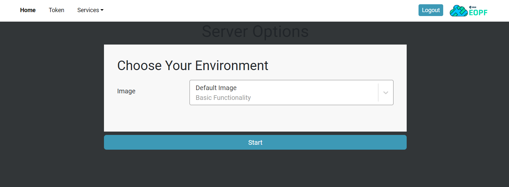
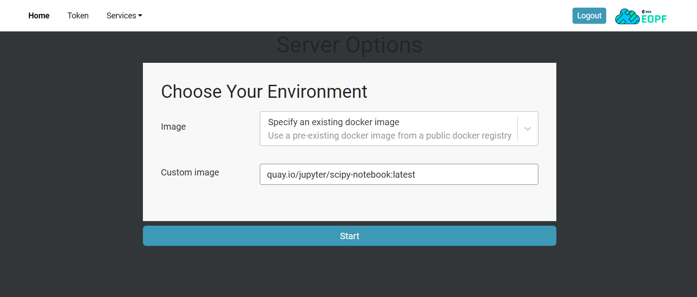
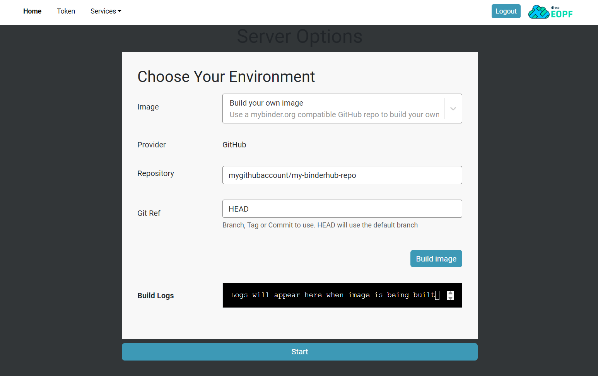
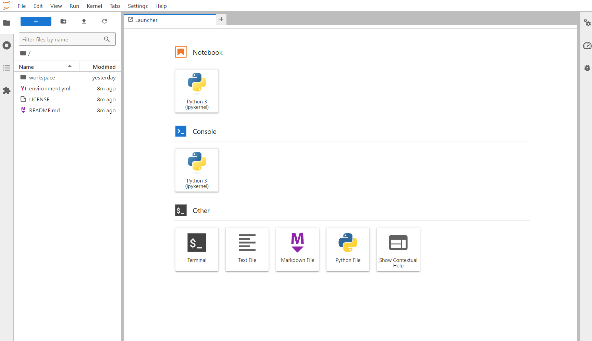
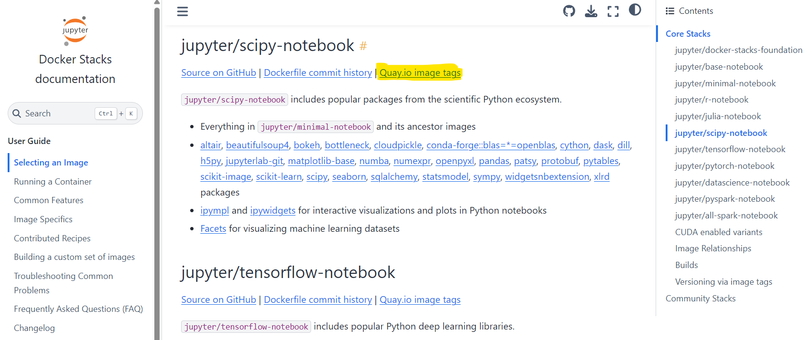
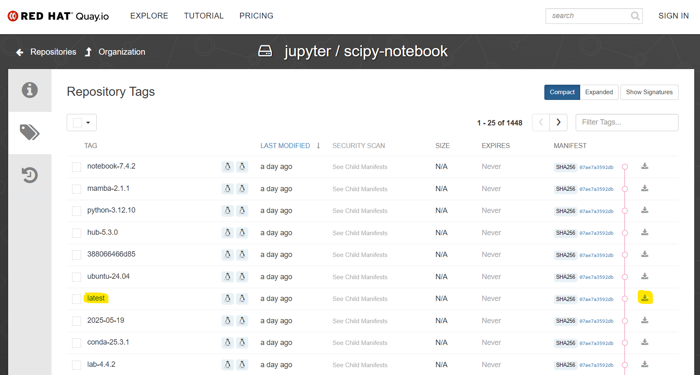
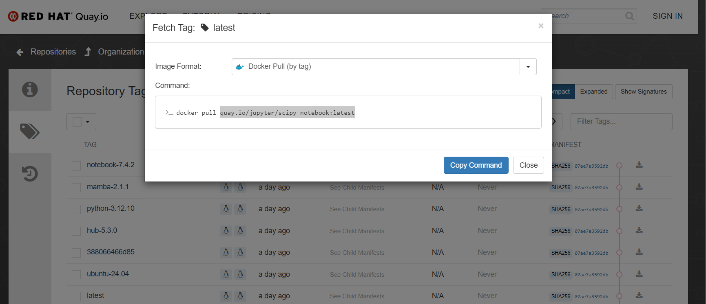

# EOPF Binder Quickstart Tutorial

## Binder

### Highlights


#### Reproducible Computing Environments

A Reproducible Computing Environment is a setup that ensures consistent and repeatable execution of computational tasks, such as data analysis or software development. All the necessary components, e.g. as code, data, libraries, and configurations, are packaged such that others are allowed to replicate the environment and obtain the same results. This is often achieved using containerization tools like Docker or environment management systems like Conda, which help to alleviate the pain of managing different software versions an configurations.

#### Containerization

Containerization involves packaging an application and its dependencies into a lightweight, isolated container. This ensures that the application runs consistently across different environments by using Docker to create portable and reproducible images. Binder leverages these containers to provide users with consistent and interactive computing environments directly from Git repositories.

#### Version Control

Version control systems are tools designed to manage changes to documents, programs, and other collections of information. They keep track of modifications, allowing multiple people to collaborate on projects efficiently. These systems enable users to revert to previous versions, compare changes, and merge updates from different contributors, ensuring a streamlined and organized workflow.

### Under the Hood

#### Git Repository

[Git](https://git-scm.com/) repositories are used in Binder to store and manage the source code, notebooks, and configuration files needed for creating reproducible computing environments. They allow for version control, which allows users to track changes, collaborate with others, and maintain different versions of their projects. When a user provides a Git repository URL to Binder, it uses the contents of the repository to build and launch the containerized environment.Platforms like [GitHub](https://github.com/) or [GitLab](https://gitlab.com/) can be used for this purpose.

#### Docker

[Docker](https://www.docker.com/) is a software designed to develop, ship, and run applications inside containers. It allows applications to be packaged with their dependencies and configurations into a standardized unit called a container. This ensures that the application runs consistently across different computing environments.

#### Kubernetes

[Kubernetes](https://kubernetes.io/) is a platform designed to automate the deployment, scaling, and management of containerized applications. It groups containers into logical units for easy management and discovery, ensuring that they run efficiently and reliably, often across multiple computing nodes. Kubernetes helps manage the lifecycle of containers, optimizing resource utilization and maintaining application availability.

#### repo2docker

[repo2docker](https://repo2docker.readthedocs.io/en/latest/index.html) is a piece of software that automates the creation of Docker images from Git repositories. It uses the configuration files to determine the necessary dependencies and environment setup, then builds a Docker image containing the application and said dependencies.

#### JupyterHub

[JupyterHub](https://jupyter.org/hub) is a multi-user server that manages and spawns individual Jupyter notebook servers for each user. It provides a central platform for accessing computational environments, for example in educational settings, research groups, and data science teams. Administrators are enabled to centrally manage user access, resources, and environments, ensuring a consistent and collaborative workspace.

#### JupyterLab

[JupyterLab](https://jupyter.org/) is a web-based interactive development environment that extends Jupyter Notebook functionality, offering a flexible interface for code, data, and document manipulation. It is particularly beneficial for data scientists, researchers, and educators who require a versatile and integrated workspace for data analysis and scientific computing. When used with JupyterHub, it enables multi-user collaboration and scalable computational workflows.


## From Zero To Binder

### Conda/PIP Environment

#### Repository

1. Initialize a repository

    * To initialize a public repository on GitHub, follow the [official instructions](https://docs.github.com/en/repositories/creating-and-managing-repositories/creating-a-new-repository). 

2. Clone the repository 

```
git clone https://github.com/<account-name>/<repository-name>
```

#### Environment

* [Conda](https://docs.conda.io/projects/conda/en/stable/user-guide/getting-started.html) is a common package manager in the Python community. Conda environments are defined by an __environment.yml__ file in the repository directory. Note that the file ending must be ```.yml``` and ___not___ ```.yaml```, as it is often used with YAML files. For example, this might look like the following:

``` YAML
name: my-binderhub-environment
channels:
  - conda-forge
dependencies:
  - python=3.12
  - matplotlib
  - numpy
```

* [PIP](https://packaging.python.org/en/latest/tutorials/installing-packages/) is the default package manager for Python. PIP environments are defined with a simple text file __requirements.txt__ that lists the required packages. However, the version of the Python interpreter is not defined here.

``` Text
matplotlib
numpy
```

* In case a specific Python version is required for the PIP environment, the file __runtime.txt__ can be created, which is used by repo2docker to install the requested version.

``` Text
python-3.12
```

### Existing Docker Image

An alternative to self-defined environments are [Jupyter Docker Stacks](https://jupyter-docker-stacks.readthedocs.io/en/latest/using/selecting.html). They provide a range of Docker images that come with different sets of pre-installed libraries and tools. These images are designed to support various use cases, from basic data analysis to advanced machine learning. BinderHub is capable of starting a computing environment based on these images.

* [Docker Core Stacks](https://jupyter-docker-stacks.readthedocs.io/en/latest/using/selecting.html#core-stacks) are maintained by the Jupyter team and are available with various languages and environments. These range from images with only basic packages to more sophisticated ones suitable for general data science use cases. The [scipy-notebook](https://jupyter-docker-stacks.readthedocs.io/en/latest/using/selecting.html#jupyter-scipy-notebook) is an example of a versatile image that "includes popular packages from the scientific Python ecosystem".

* [Docker Community Stacks](https://jupyter-docker-stacks.readthedocs.io/en/latest/using/selecting.html#community-stacks) are maintained by the Jupyter community and are typically built on top of the previously mentioned core images. They provide environments for various other languages and specific use cases. One of these images is the [cgspatial-notebook](https://github.com/SCiO-systems/cgspatial-notebook) that "includes major geospatial Python & R libraries on top of the datascience-notebook image".

## Step By Step Example

The journey to a Binder environment starts with signing in via the button __Sign in with CDSE Idp__.



Subsequently, a __login__ in with __email__ and __password__ is required.


Now the BinderHub server needs to be started by clicking on __Start My Server__.




#### Default Image



All that needs to be done is clicking on __Start__. After the loading screen, a default Python-based image is ready to use.

#### Docker Stacks



Again, a click on __Start__ is followed by the image build and finally a useable environment based on the given image. For further instructions on how to get the correct link the an image, read the [addendum](#addendum).

#### Conda/PIP Environment



Currently, only repositories hosted on GitHub are supported. Under the __Repository__ field, the name of the repository in the form ```account-name/repository-name``` is expected. A branch, tag, or commit can also be specified under __Git Ref__. By clicking on __Build image__, the build process is started. Once completed, the __Build Logs__ will display the message ```Image has been built. Click the start button to launch your server```. Clicking on __Start__ will then start the environment.

Finally, once the image has been built and started, the Jupyter environment is ready for use.




#### Addendum

To get the correct link to a Docker Stacks image, follow the link __Quay.io image tags__. 



From the list of tags for a given idea, it is usually recommended to choose the __latest__ tag, which contains the most recent version of this image.



With a click on the right-most button __Fetch Tag__ on the line of the __latest__ tag, the image format can be chosen. From the image format __Docker Pull (by tag)__, only the highlighted part on the image below is required. This path is the correct one for the field __Custom image__ in the __Choose Your Environment__ part.

